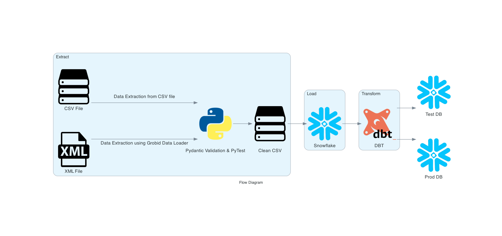

## Live Application Links

[](https://codelabs-preview.appspot.com/?file_id=1RgJU3pAtNpP0PdpzN2YAPoo4_h9Krv-gOW_tsVX5BiU#0)

[](https://www.snowflake.com/)

[](https://cloud.getdbt.com/)

## Technologies Used

[](https://www.python.org/)
[](https://github.com/kermitt2/grobid)
[](https://www.snowflake.com/)
[](https://cloud.getdbt.com/)
[](https://www.sqlalchemy.org/)

## Problem Statement

Many data-driven projects involve extracting data from various sources, such as CSV and XML files, and transforming it for analysis or storage. However, ensuring the quality and integrity of this data throughout the process can be challenging. Schema validation and testing are essential steps to validate and correct data discrepancies before loading it into a data warehouse or database.

## Project Goals

The goal of this project is to develop an ELT (Extract, Load, Transform) framework to leverage advanced data techniques for data validation and transformation. Our approach is methodical and spans five critical phases:

1. Extracting data and performing schema validation using PyDantic:

   - We processed data extracted from web scrapes and CSV files, and parsed metadata along with content from TEI-XML files, which were processed using Grobid.
   - To ensure data integrity, we utilized PyDantic for defining data classes, implementing validations against a custom schema.
   - This included various checks, such as hierarchy levels, identifier formats, and the correctness of URLs, using regular expressions among others.

2. Writing pytests to ensure the quality of data:

   - To guarantee the data met our standards, we developed a suite of pytest cases.
   - These tests, both positive and negative, were crafted around the previously established validation rules to thoroughly vet the data integrity.

3. Correcting invalid data and generating clean CSVs post-validation:

   - Following the testing phase, our focus shifted to refining the data.
   - We corrected discrepancies identified during validation, resulting in the generation of cleaned CSV files.
   - These refined datasets were poised for further processing and analysis.

4. Loading the cleaned data into Snowflake:

   - In the next phase, we meticulously designed a schema in Snowflake to mirror the structure of the cleansed data.
   - This prepared dataset was then efficiently loaded into Snowflake, setting the stage for advanced data exploration and analysis.

5. Performing transformations on Snowflake data using DBT
   - Leveraging the power of DBT connected to Snowflake, we embarked on a series of data transformations.
   - This process involved creating models, materializing these models, and conducting tests.
   - After rigorous testing, the models were deployed into both test and production environments, ensuring the data was optimized for actionable insights.

## Architecture:



## Data Sources

The data sources utilized in this assignment are as follows:

1. CFA Institute’s Website: The primary source for extracting finance professional development materials, including introductions, learning outcomes, and summaries of various topics.

2. PDF Documents: These documents are Accessed through direct links on the CFA Institute's website and provide in-depth outlines and detailed content on specific finance-related topics.

These sources are pivotal for creating a rich dataset and extracting valuable insights for the finance professional community.

## Pre-requisites

Before running this project, ensure you have the following prerequisites set up:

- **Python**: Ensure Python is installed on your system.
- **Virtual Environment**: Set up a virtual environment to manage dependencies and isolate your project's environment from other Python projects. You can create a virtual environment using `virtualenv` or `venv`.
- **requirements.txt**: Install the required Python dependencies by running the command:
  ```
  pip install -r requirements.txt
  ```
- **Config File**: Set up the `configurations.properties` file with the necessary credentials and configurations.

- **Graphviz**: Graphviz is needed for generating the architecture diagram.

  On Windows:

  ```
  choco install graphviz
  ```

  On macOS and Linux:

  ```
  brew install graphviz
  ```

- **Snowflake**: Create a Snowflake warehouse, database, and schema. Ensure you have the necessary credentials and configurations set up in the `configurations.properties` file for connecting to Snowflake.

## Program Structure

```
.
├─ .gitignore
├─ README.md
├─ corrections
│  ├─ correction_pdf_content.py
│  ├─ correction_pdf_metadata.py
│  └─ correction_url_class.py
├─ data
│  ├─ input
│  │  ├─ csv-input-files
│  │  │  ├─ pdf_content.csv
│  │  │  └─ scraped_data.csv
│  │  └─ grobid-files
│  │     ├─ 2024-l1-topics-combined-2.pdf.tei.xml
│  │     ├─ 2024-l2-topics-combined-2.grobid.tei.xml
│  │     └─ 2024-l3-topics-combined-2.pdf.tei.xml
│  └─ output
│     ├─ clean_pdf_content.csv
│     ├─ clean_pdf_metadata.csv
│     └─ clean_url_class.csv
├─ pytests
│  ├─ test_pdf_content.py
│  ├─ test_pdf_metadata.py
│  └─ test_url_class.py
├─ requirements.txt
├─ upload_clean_to_db.ipynb
└─ utils
   ├─ __init__.py
   ├─ model_pdf_content.py
   ├─ model_pdf_metadata.py
   └─ model_url_class.py
```

©generated by [Project Tree Generator](https://woochanleee.github.io/project-tree-generator)

## How to Run the Application Locally

Follow these steps to run the application locally from scratch:

Activate the virtual environment:

- On Windows:

```

venv\Scripts\activate

```

- On macOS and Linux:

```

source venv/bin/activate

```

1. **Installation**: Install the required Python dependencies by running `pip install -r requirements.txt`.

2. **Configurations**: Make changes in the `configurations.properties` file to configure application settings and credentials.

3. **Run Validation Scripts**: Run all the 3 scripts in `utils` folder to perform Pydantic validations.

4. **Run Tests**: Run pytest command to check quality of data.

5. **Generate Clean CSV**: Run 3 scripts in the `corrections` folder.

6. **Snowflake Setup**: Check Snowflake configurations and run `upload_to_db.ipynb` to upload the CSV file generated in step 5 to the Snowflake database.

7. **DBT**: run DBT script on dbt-cloud.

## Learning Outcomes

By completing this assignment, you will:

- Learn how to efficiently extract data from different sources like CSV files and TEI-XML files.
- Understand the process of parsing and processing data for further use.
- Gain knowledge on using PyDantic for creating data classes and performing schema-based validations.
- Acquire skills in writing comprehensive test cases using pytest to ensure data integrity.
- Learn how to design both positive and negative test scenarios to cover a wide range of data validation requirements.
- Develop the ability to interpret test results for identifying and addressing data quality issues.
- Understand the methods for identifying invalid data through validation tests.
- Learn the process of correcting data discrepancies and preparing clean datasets.
- Gain knowledge on the best practices for generating and maintaining clean CSV files post-validation.
- Learn how to create and manage schemas in Snowflake to accommodate cleaned data.
- Understand the process of loading clean data into Snowflake, ensuring it is ready for further processing and analysis.
- Gain insights into the integration of Snowflake with DBT for data transformation.
- Learn how to create models, materialize them, and perform testing within DBT.
- Acquire the skills to deploy models into test and production environments, facilitating data analysis and decision-making processes.

## Team Information and Contribution
| Name                      | Contribution % | Contributions |
| ------------------------- | -------------- | ------------- |
| Muskan Deepak Raisinghani | 40%            | Schema Validation, pytest and correction for URLClass, Loading data to snowflake, pytest for PDFMetadataClass, Readme |
| Rachana Keshav            | 40%            | Schema Validation, pytest and correction for PDFContentClass, DBT transformation, schema validation for PDFMetadata |
| Ritesh Choudhary          | 20%            | Basic Schema validation for all classes, Flow Diagram, Readme, DBT tests |

```

```
